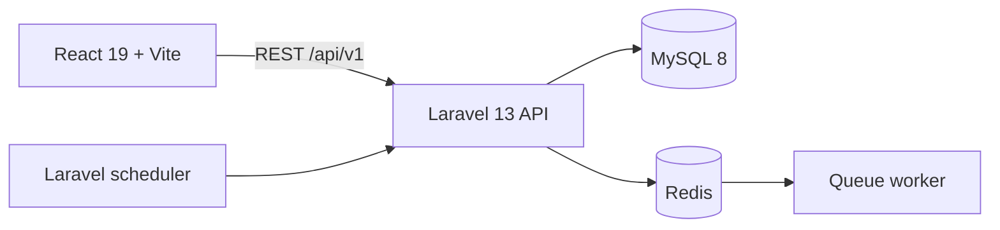

# StockPilot

StockPilot is a separated React/Laravel inventory and warehouse management portfolio application. The backend is a versioned REST API; the frontend communicates only over HTTP and uses secure Sanctum SPA cookies.

## Architecture



The backend is a modular monolith with thin API controllers and transactional services for inventory, receiving, and transfers. Every quantity mutation locks its inventory row, writes a stock movement, and updates the low-stock state in the same transaction. Database constraints prevent duplicate product/warehouse balances and duplicate business references.

## Included

- Sanctum cookie authentication, active-account middleware, RBAC, and warehouse assignments
- Products, hierarchical categories, brands, units, suppliers, warehouses, and per-warehouse inventory
- Immutable stock movement ledger, manual stock in/out, reservations, negative-stock prevention, and low-stock alerts
- Purchase order and partial goods-receiving schema/workflow
- Approval/shipping/receiving transfer workflow without in-transit duplication
- Sales orders, adjustments, audit logs, settings, notifications-ready schema, dashboard KPIs, and server pagination
- Responsive React admin shell, protected routes, dashboard chart, data table states, API error handling, and production build
- MySQL, Redis, API, queue, scheduler, and web Docker services

## Project layout

```text
stockpilot-api/   Laravel 13 REST API
stockpilot-web/   React 19 Vite SPA
docs/API.md       Workflow-oriented API reference
docker-compose.yml
```

## Local setup

Requirements: PHP 8.4, Composer 2, Node 20+, npm 10+, MySQL 8+, and Redis 7+.

```bash
cd stockpilot-api
composer install
cp .env.example .env
php artisan key:generate
# Configure MySQL credentials in .env
php artisan migrate --seed
php artisan serve
```

In separate terminals:

```bash
cd stockpilot-api && php artisan queue:work
cd stockpilot-api && php artisan schedule:work
cd stockpilot-web && npm install && npm run dev
```

Frontend environment: copy `stockpilot-web/.env.example` to `.env`. For cookie auth, keep the frontend host in `SANCTUM_STATEFUL_DOMAINS` and `FRONTEND_URL`.

## Docker

Copy `stockpilot-api/.env.example` to `.env`, set `DB_HOST=mysql`, `REDIS_HOST=redis`, database password to `stockpilot_local`, then run:

```bash
docker compose up --build -d
docker compose exec api php artisan key:generate
docker compose exec api php artisan migrate --seed
```

Frontend: `http://localhost:5173`; API: `http://localhost:8000`.

## Demo account

- Email: `admin@stockpilot.test`
- Password: `StockPilot123!`

Demo credentials are created only by the development seeder. Never run that seeder in production.

## Verification

```bash
cd stockpilot-api && composer test
cd stockpilot-web && npm run lint && npm run build
```

## Security and operations

No secrets are committed. Backend policies are enforced independently of UI visibility. Money uses fixed-point decimals. Historical products use soft deletion; inventory transactions are not exposed to ordinary deletion. Files should be stored through Laravel Storage, allowing an S3 disk without changing callers. See [API documentation](docs/API.md) for business workflow contracts.

## Screenshots

Add portfolio screenshots of the seeded dashboard, inventory list, receiving flow, and transfer detail after deployment.

## Optional next enhancements

Email delivery channels, printable barcode labels, Excel/PDF exports, cycle-count scheduling, and weighted-average costing can be layered on without changing the inventory ledger contract.
